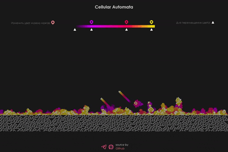

# Клеточный автомат. rule30 + b3s23(Conway)

---

---

## [<a href="https://knyazev13ivan.github.io/cellular-automata-rule30/">**Live Demo**</a>]

---

<a href="https://ru.wikipedia.org/wiki/%D0%9F%D1%80%D0%B0%D0%B2%D0%B8%D0%BB%D0%BE_30"><strong>Rule 30</strong></a> — 1D клеточный автомат с двумя состояниями (0 и 1), впервые описанный Стивеном Вольфрамом в 1983 году.  
<a href="https://ru.wikipedia.org/wiki/%D0%98%D0%B3%D1%80%D0%B0_%C2%AB%D0%96%D0%B8%D0%B7%D0%BD%D1%8C%C2%BB"><strong>Conway's Game of Life</strong></a> - 2D клеточный автомат, придуманный английским математиком Джоном Конвеем в 1970 году.

Это реализация их <em>слияния</em> путем добавления 1D массива Rule 30 в 2D массив Conway при каждой итерации с последующим удалением.

Графика сделанна с помощью <strong>Canvas API</strong> и <strong>requestAnimationFrame</strong>.

